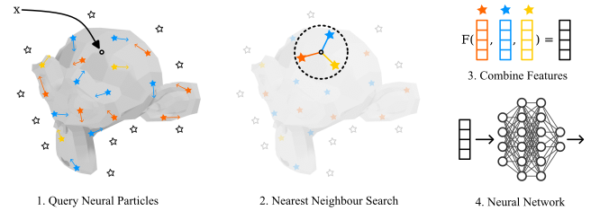

# ParticleNeRF

> __ParticleNeRF: Particle Based Encoding for Online Neural Radiance Fields__  
> Jad Abou-Chakra, [Feras Dayoub](https://ferasdayoub.com/), [Niko Sunderhauf](https://nikosuenderhauf.github.io/)\
> __[Project page](https://sites.google.com/view/particlenerf)&nbsp;/ [Paper](https://arxiv.org/abs/2211.04041)&nbsp;__

ParticleNeRF is a fork of [__instant_ngp__](https://github.com/NVlabs/instant-ngp) that uses a particle-based encoding to enable quick adaptation to dynamic objects. By associating features with particles in space, we can backpropagate the photometric reconstruction loss into the particles' position gradients, which can then be interpreted as velocity vectors. To handle collisions, a lightweight physics system governs the movement of the features, allowing them to move freely with the changing scene geometry. We demonstrate ParticleNeRF on various dynamic scenes containing translating, rotating, articulated, and deformable objects.


# Method


A query point is sampled in space. The features and positions of the particles within a search radius are retrieved. The features and distances from the query point are used to interpolate the feature at the query point. The resulting feature is evaluated by the neural network to give color and density. To train the encoding, the loss gradients are backpropagated through the network, the query feature, and finally into the positions and features of the particles.

# Examples


# License and Citation

```bibtex
@article{abou2022particlenerf,
  title={ParticleNeRF: Particle Based Encoding for Online Neural Radiance Fields},
  author={Abou-Chakra, Jad and Dayoub, Feras and S{\"u}nderhauf, Niko},
  journal={arXiv preprint arXiv:2211.04041},
  year={2022}
}
```

This work is made available under the Nvidia Source Code License-NC. Click [here](LICENSE.txt) to view a copy of this license.
